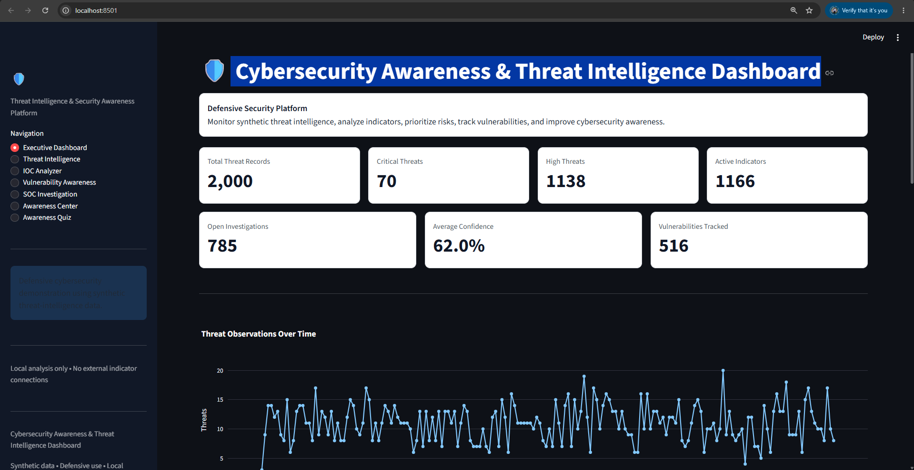
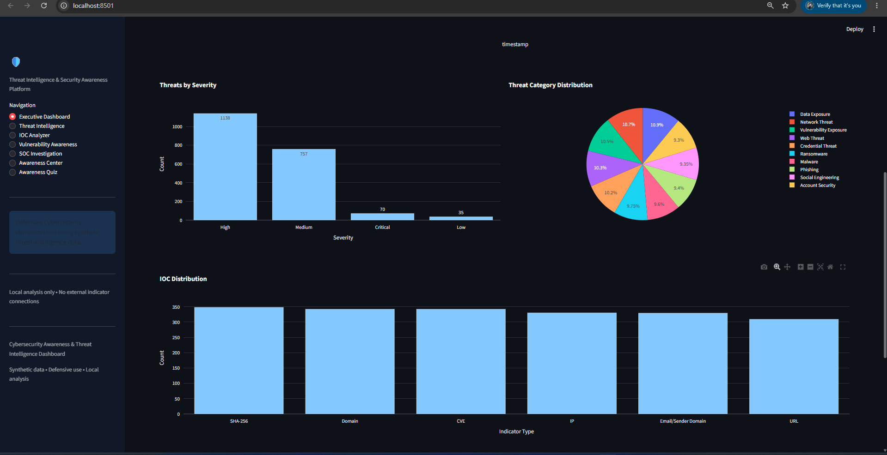
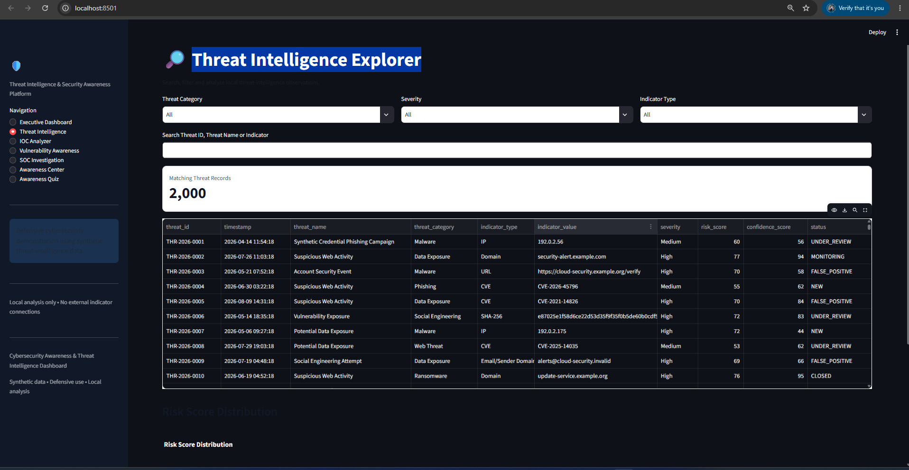
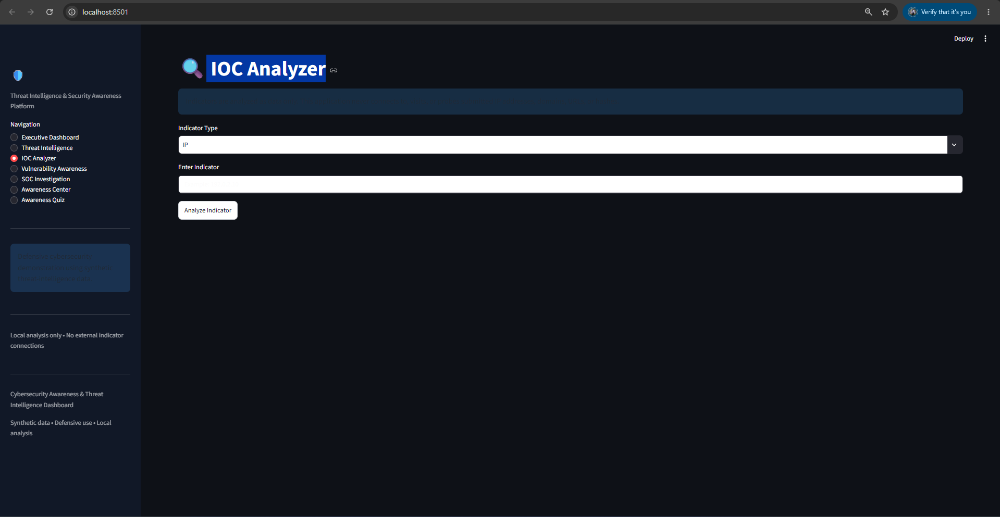
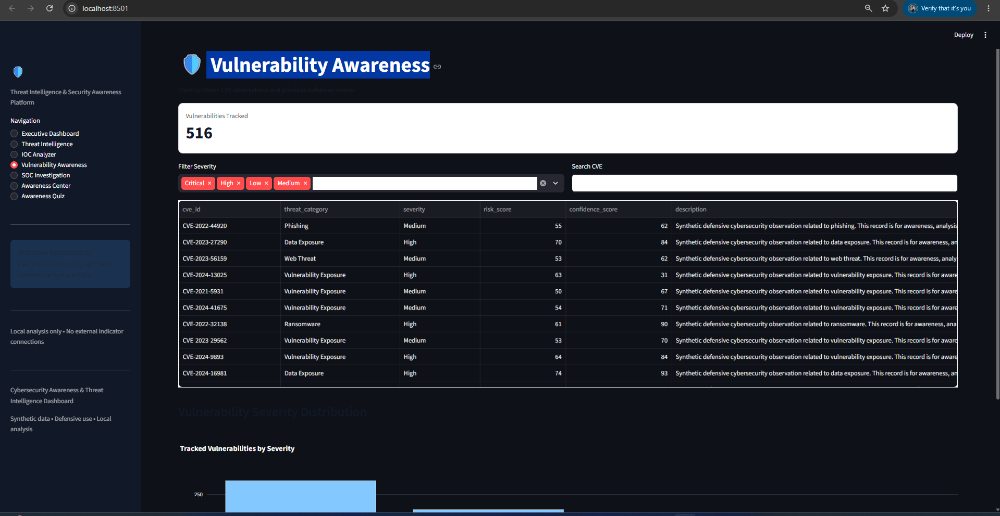
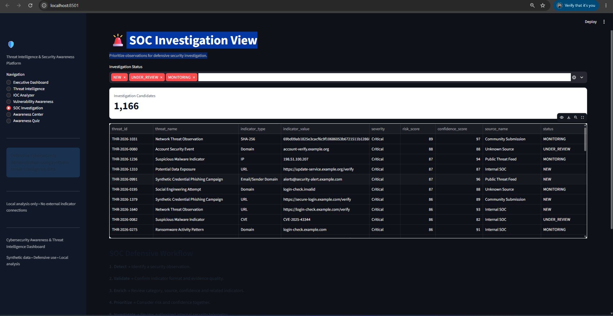
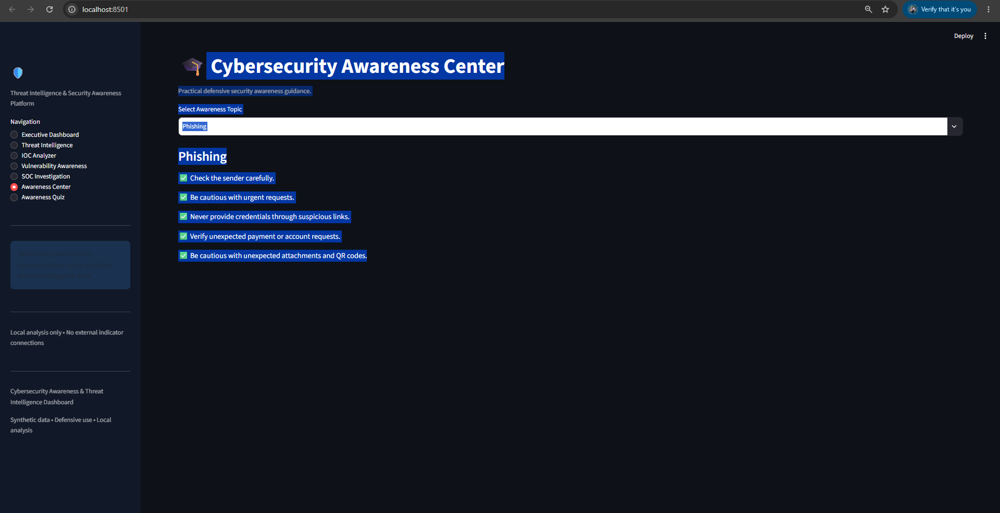
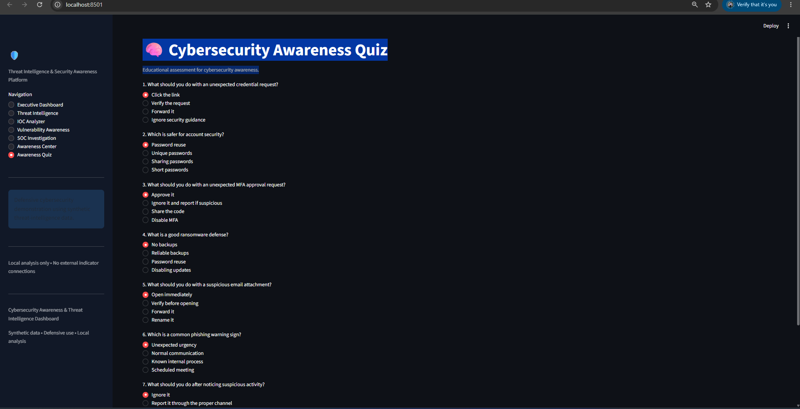

# 🛡️ Cybersecurity Awareness & Threat Intelligence Dashboard

A defensive cybersecurity analytics platform built with **Python, Streamlit, Pandas, NumPy, Plotly, and Scikit-learn**. The dashboard combines **threat intelligence analysis, IOC validation, risk and confidence scoring, vulnerability awareness, SOC investigation workflows, MITRE ATT&CK concepts, and cybersecurity awareness training** into a single interactive application.

> **Project Type:** Defensive Cybersecurity Analytics
> **Application:** Interactive Streamlit Dashboard
> **Data:** Synthetic / Safe Offline Threat Intelligence Data
> **Status:** Completed & Tested

---

## 📌 Overview

The **Cybersecurity Awareness & Threat Intelligence Dashboard** is designed to help security analysts, students, and organizations understand and analyze cybersecurity threats through a centralized defensive analytics interface.

The application processes synthetic threat intelligence records and provides interactive views for:

* Threat intelligence monitoring
* Indicator of Compromise (IOC) analysis
* Threat categorization
* Risk and confidence scoring
* Vulnerability awareness
* SOC investigation workflows
* MITRE ATT&CK mapping concepts
* Security awareness education
* Cybersecurity quizzes
* Executive-level security summaries

The project focuses exclusively on **defensive cybersecurity, threat awareness, analytics, and security education**.

---

# 🎯 Problem Statement

Cybersecurity teams often need to analyze large amounts of threat-related information from different sources while maintaining a clear understanding of:

* What threats are being observed?
* Which indicators require attention?
* How severe is a threat?
* How confident are we in the available evidence?
* Which vulnerabilities require prioritization?
* How should analysts investigate an indicator?
* What security-awareness weaknesses should users improve?

This project addresses these challenges through a centralized dashboard that transforms synthetic threat intelligence data into **visual, searchable, and actionable defensive insights**.

---

# 🎯 Objectives

The main objectives are to:

1. Centralize threat intelligence information.
2. Analyze Indicators of Compromise (IOCs).
3. Validate indicator formats safely.
4. Classify threats by category and severity.
5. Calculate and visualize risk scores.
6. Analyze confidence levels associated with threat observations.
7. Provide vulnerability awareness and prioritization.
8. Demonstrate SOC investigation workflows.
9. Introduce MITRE ATT&CK concepts.
10. Improve cybersecurity awareness through educational modules.
11. Provide an interactive cybersecurity quiz.
12. Present security information through an executive dashboard.

---

# 🔐 Cybersecurity Relevance

The project demonstrates practical concepts from:

* Cyber Threat Intelligence (CTI)
* Security Operations Center (SOC)
* Indicator of Compromise (IOC) analysis
* Threat classification
* Risk assessment
* Confidence scoring
* Vulnerability management
* Security awareness
* Incident response concepts
* MITRE ATT&CK
* Threat correlation
* Defensive security analytics

---

# 🚀 Key Features

## 1. Executive Dashboard

Provides a high-level overview of the current threat landscape.

### Dashboard Metrics

* Total Threat Records
* Critical Threats
* High Threats
* Active Indicators
* Open Investigations
* Average Confidence
* Vulnerabilities Tracked

### Visualizations

* Threats over time
* Severity distribution
* Threat category distribution
* IOC distribution
* Risk distribution
* Confidence distribution
* Status distribution


---

# 🕵️ 2. Threat Intelligence

The Threat Intelligence module allows analysts to explore synthetic threat records.

### Supported Information

* Threat ID
* Threat name
* Threat category
* Indicator type
* Indicator value
* Source
* Severity
* Risk score
* Confidence score
* Status
* First seen
* Last seen
* Description
* MITRE ATT&CK information
* CVE information

### Threat Categories

* Phishing
* Malware
* Ransomware
* Credential Threats
* Web Threats
* Network Threats
* Vulnerability Exposure
* Social Engineering
* Data Exposure
* Account Security


---

# 🔎 3. IOC Analyzer

The IOC Analyzer provides safe local analysis of indicators without connecting to or interacting with external infrastructure.

### Supported Indicators

* IP addresses
* Domains
* URLs
* File hashes
* CVE identifiers

### IOC Validation

The application checks whether an indicator follows the expected syntax and format.

Validation includes:

* IPv4 format
* Domain format
* URL format
* SHA-256 format
* CVE format

> **Important:** Validating an indicator only confirms its syntax. It does not prove that the indicator is malicious.


---

# 📊 4. Risk & Confidence Scoring

The project distinguishes between **risk** and **confidence**.

### Risk Score

Risk represents the potential concern associated with an observation.

The conceptual scoring model considers:

* Severity
* Confidence
* Recency
* Observation frequency
* Source reliability
* Context and correlation

### Risk Levels

|  Score | Classification |
| -----: | -------------- |
|   0–20 | Informational  |
|  21–40 | Low            |
|  41–60 | Medium         |
|  61–80 | High           |
| 81–100 | Critical       |

### Confidence Score

Confidence represents the quality or strength of the available evidence.

A high risk score does **not** automatically mean that a compromise has occurred.

---

# 🧩 5. Vulnerability Awareness

The vulnerability module provides a defensive view of vulnerability information.

It considers concepts such as:

* CVE identifier
* Product category
* Severity
* CVSS score
* Published date
* Patch availability
* Exploitation status
* Vulnerability description

### Prioritization Factors

Vulnerability prioritization can consider:

* CVSS severity
* Asset criticality
* Exposure
* Exploitation evidence
* Business context


---

# 🛡️ 6. SOC Investigation

The SOC Investigation module demonstrates a simplified defensive Security Operations Center workflow.

### Workflow

```text
Threat Feed
     ↓
IOC
     ↓
Validation
     ↓
Enrichment
     ↓
Risk & Confidence Scoring
     ↓
Alert
     ↓
Triage
     ↓
Correlation
     ↓
Investigation
     ↓
Monitor / Escalate / Resolve
```

The application emphasizes that an observed indicator should be investigated and contextualized before treating it as a confirmed incident.


---

# 🎯 7. MITRE ATT&CK Concepts

The dashboard incorporates MITRE ATT&CK concepts to help analysts understand how observed threat information can relate to adversary behavior.

The project considers:

* Tactics
* Techniques
* Sub-techniques
* Threat behavior context

An IOC describes **what artifact was observed**, while ATT&CK mapping can help describe **how the associated behavior may relate to an adversary technique**.

ATT&CK mapping should only be applied when sufficient context exists.

---

# 🚨 8. Alert Management

The project demonstrates defensive alert-management concepts based on conditions such as:

* High risk score
* Confidence threshold
* High-priority vulnerabilities
* Repeated observations
* Correlated indicators

Example alert statuses include:

* NEW
* INVESTIGATING
* MONITORING
* RESOLVED
* FALSE_POSITIVE

Correlation can help reduce unnecessary alert noise and improve analyst focus.

---

# 🎓 9. Cybersecurity Awareness Center

The Awareness Center provides educational cybersecurity content covering topics such as:

* Phishing
* Password Security
* Multi-Factor Authentication
* Social Engineering
* Safe Browsing
* Secure Wi-Fi
* Software Updates
* Ransomware Awareness
* USB / Removable Media
* Data Privacy
* Mobile Security
* Remote Work Security
* Cloud Account Security
* Incident Reporting
* AI-enabled Scam Awareness


---

# 📝 10. Cybersecurity Awareness Quiz

The project includes an interactive security-awareness quiz designed to reinforce defensive cybersecurity knowledge.

Topics include:

* Phishing
* Password security
* MFA
* Social engineering
* Safe browsing
* Ransomware awareness
* Privacy
* Wi-Fi security
* Mobile security
* Incident reporting

### Awareness Score

|  Score | Level             |
| -----: | ----------------- |
|   0–40 | Needs Improvement |
|  41–60 | Basic             |
|  61–80 | Good              |
| 81–100 | Strong            |

The score is intended as an **educational indicator**, not as an employee competency or fitness judgment.


---

# 🏗️ Architecture

```text
                    ┌─────────────────────────┐
                    │ Synthetic Threat Data   │
                    └────────────┬────────────┘
                                 │
                                 ▼
                    ┌─────────────────────────┐
                    │ Data Collection         │
                    │ & Normalization         │
                    └────────────┬────────────┘
                                 │
                                 ▼
                    ┌─────────────────────────┐
                    │ IOC Validation          │
                    │ & Classification        │
                    └────────────┬────────────┘
                                 │
                                 ▼
                    ┌─────────────────────────┐
                    │ Risk & Confidence       │
                    │ Scoring                 │
                    └────────────┬────────────┘
                                 │
                 ┌───────────────┼───────────────┐
                 ▼               ▼               ▼
        ┌──────────────┐ ┌──────────────┐ ┌──────────────┐
        │ Threat Intel │ │ Vulnerability│ │ SOC          │
        │ Dashboard    │ │ Awareness    │ │ Investigation│
        └──────────────┘ └──────────────┘ └──────────────┘
                 │               │               │
                 └───────────────┼───────────────┘
                                 ▼
                    ┌─────────────────────────┐
                    │ Cybersecurity Awareness │
                    │ & Quiz                  │
                    └─────────────────────────┘
```

---

# 🧰 Technology Stack

| Technology   | Purpose                               |
| ------------ | ------------------------------------- |
| Python       | Core programming                      |
| Streamlit    | Interactive web dashboard             |
| Pandas       | Data processing                       |
| NumPy        | Numerical operations                  |
| Plotly       | Interactive visualizations            |
| Scikit-learn | Security analytics / scoring support  |
| Pytest       | Automated testing                     |
| CSV          | Synthetic threat intelligence storage |
| Git & GitHub | Version control and project hosting   |

---

# 📁 Project Structure

```text
Cybersecurity-Awareness-Threat-Intelligence-Dashboard/
│
├── data/
│   └── threat_intelligence_dataset.csv
│
├── screenshots/
│   ├── 01_executive_dashboard.png
│   ├── 02_threat_intelligence.png
│   ├── 03_ioc_analyzer.png
│   ├── 04_vulnerability_awareness.png
│   ├── 05_soc_investigation.png
│   ├── 06_awareness_center.png
│   └── 07_awareness_quiz.png
│
├── tests/
│   └── test_app.py
│
├── .streamlit/
│
├── app.py
├── generate_data.py
├── requirements.txt
├── README.md
└── .gitignore
```

---

# 📊 Dataset

The project uses a **synthetic threat intelligence dataset containing 2,000 records**.

The dataset contains fields such as:

```text
threat_id
timestamp
threat_name
threat_category
indicator_type
indicator_value
source_name
confidence_score
severity
risk_score
status
first_seen
last_seen
country_or_region_optional
description
mitre_tactic_optional
mitre_technique_optional
cve_id_optional
```

The synthetic approach allows the dashboard to demonstrate cybersecurity analytics without interacting with live malicious infrastructure.

---

# ⚙️ Installation

## 1. Clone the Repository

```bash
git clone https://github.com/YOUR_USERNAME/Cybersecurity-Awareness-Threat-Intelligence-Dashboard.git
```

## 2. Open the Project

```bash
cd Cybersecurity-Awareness-Threat-Intelligence-Dashboard
```

## 3. Create a Virtual Environment

```bash
python -m venv .venv
```

## 4. Activate the Environment

### Windows PowerShell

```powershell
.venv\Scripts\Activate.ps1
```

## 5. Install Dependencies

```bash
python -m pip install -r requirements.txt
```

## 6. Run the Application

```bash
streamlit run app.py
```

The dashboard will open in your browser.

---

# 🧪 Testing

Automated tests are implemented using **Pytest**.

Run:

```bash
pytest
```

### Current Test Result

```text
23 passed in 0.54s
```

The tests cover areas including:

* IP validation
* Domain validation
* URL validation
* Hash validation
* CVE validation
* Dataset existence
* Required columns
* Risk score ranges
* Confidence score ranges
* Severity values
* Indicator types
* Status values
* Threat ID uniqueness
* Data quality

---

# 🔒 Security & Privacy

This project is intentionally designed for **defensive cybersecurity education and analytics**.

### Safety Principles

* Uses synthetic threat intelligence data.
* Runs locally.
* Does not execute malware.
* Does not exploit vulnerabilities.
* Does not perform network scanning.
* Does not probe external systems.
* Does not contact suspicious IP addresses or domains.
* Does not create real phishing pages.
* Does not send malicious payloads.
* IOC searches operate against local project data.

Indicators are treated strictly as **data for analysis**.

---

# 📌 Important Cybersecurity Distinction

The project distinguishes between:

```text
Observation
    ↓
Indicator
    ↓
Alert
    ↓
Threat Assessment
    ↓
Investigation
    ↓
Incident
```

A suspicious indicator does **not automatically mean that a security incident or compromise has occurred**.

Analysts should validate, enrich, correlate, and investigate available evidence before drawing conclusions.

---

# 🔮 Future Improvements

Potential future enhancements include:

* Authorized live threat-intelligence feeds
* STIX/TAXII integration
* SIEM integration
* SOAR integration
* CVE/CISA KEV integration
* EPSS-style prioritization
* IOC deduplication
* IOC expiration tracking
* Advanced threat correlation
* ATT&CK Navigator integration
* Threat hunting workflows
* Endpoint security integration
* Email security telemetry
* Cloud security integrations
* Executive reporting
* Role-based dashboards
* Docker deployment
* CI/CD integration
* Advanced analytics and clustering

These improvements would remain within an authorized and defensive cybersecurity context.

---

# 📸 Screenshots

## Executive Dashboard



## Threat Intelligence



## IOC Analyzer



## Vulnerability Awareness



## SOC Investigation



## Awareness Center



## Awareness Quiz



## Additional Dashboard View


---

# 🎓 Learning Outcomes

Through this project, the following practical concepts were demonstrated:

* Cyber Threat Intelligence
* IOC analysis
* Threat classification
* Risk scoring
* Confidence scoring
* Vulnerability awareness
* SOC workflows
* Alert management
* Threat correlation
* MITRE ATT&CK concepts
* Security awareness
* Incident response concepts
* Python data analysis
* Interactive cybersecurity visualization
* Automated testing
* Git/GitHub project management

---

# 💼 Project Highlights

### Technical Highlights

* Built an interactive cybersecurity dashboard using Streamlit.
* Processed 2,000 synthetic threat intelligence records.
* Implemented local IOC validation and analysis.
* Added risk and confidence scoring.
* Developed threat and vulnerability analytics.
* Implemented SOC investigation workflow visualization.
* Added cybersecurity awareness modules and an interactive quiz.
* Created automated tests using Pytest.
* Achieved **23/23 automated tests passing**.

---

# ⚠️ Ethical Disclaimer

This project is intended strictly for **educational, research, cybersecurity awareness, and defensive security analytics purposes**.

All threat intelligence data used in the demonstration is synthetic or safe demonstration data.

The application does not perform unauthorized scanning, exploitation, malware execution, phishing, credential theft, or interaction with malicious infrastructure.

Users should only perform cybersecurity testing against systems and data for which they have explicit authorization.

---

# 👩‍💻 Author

**Sai Hema**

B.Tech Computer Science Engineering
Interests: **Artificial Intelligence, Machine Learning, Cybersecurity, Data Science & Full-Stack Development**

---

## ⭐ If You Find This Project Useful

Consider giving the repository a ⭐ on GitHub and exploring the project to learn more about defensive cybersecurity analytics.

**Built with Python • Streamlit • Data Analytics • Cybersecurity**
